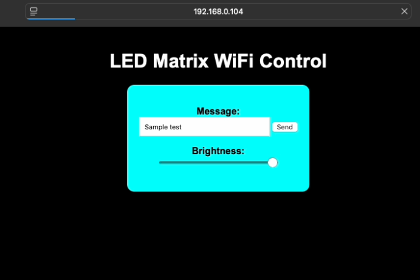

# ESP8266-LEDMatrix-WiFiDisplay
# ESP8266 LED Matrix WiFi Display

This project displays text on a MAX7219-based LED matrix using an ESP8266 module (e.g., NodeMCU). It allows users to control the displayed text and brightness level via a browser-based interface hosted by the ESP8266.

## Sketch and Code
💡 The main sketch is in [LEDMatrix_WiFi.ino](LEDMatrix_WiFi.ino), but you can also view the syntax-highlighted C++ version here: [LEDMatrix_WiFi_Code.cpp](ESP8266_LED_Matrix_code.cpp)

## 🔧 Features

- ESP8266 auto-connects to saved WiFi or creates an access point if none is found.
- Web-based interface for:
  - Sending custom text to the display
  - Adjusting display brightness
- Clean, styled HTML interface
- Displays IP address after successful WiFi connection

## 📱 How It Works

1. On boot, ESP8266 looks for previously connected WiFi.
2. If not found, it opens a captive portal via WiFiManager.
3. User connects to `ESP8266_LED_AP` and selects a network.
4. After connecting, the IP address is shown on the LED matrix.
5. Enter the IP in a browser to control the display.

## 🧰 Requirements

- **Board:** ESP8266 (NodeMCU, Wemos D1 Mini, etc.)
- **Display:** MAX7219-based 4-in-1 LED Matrix (FC16_HW)
- **Libraries:**
  - [`MD_MAX72xx`](https://github.com/MajicDesigns/MD_MAX72XX)
  - [`WiFiManager`](https://github.com/tzapu/WiFiManager)
- **IDE:** Arduino IDE

## 🚀 Getting Started

1. Install the libraries via Arduino Library Manager or copy to `libraries/`
2. Flash the `LEDMatrix_WiFi.ino` using Arduino IDE
3. On first boot, it will reset saved WiFi and start `ESP8266_LED_AP`
4. Connect and configure WiFi

> Tip: Remove or comment out `wifiManager.resetSettings();` after testing to preserve WiFi credentials across reboots.

## 🛡️ Security

- This code is safe to flash.
- It does **not expose** your WiFi credentials or IP to any external network.
- It uses local-only HTTP communication.
- `wifiManager.resetSettings();` ensures no credentials persist unintentionally before first setup.

## 📄 License

[MIT License](LICENSE)

