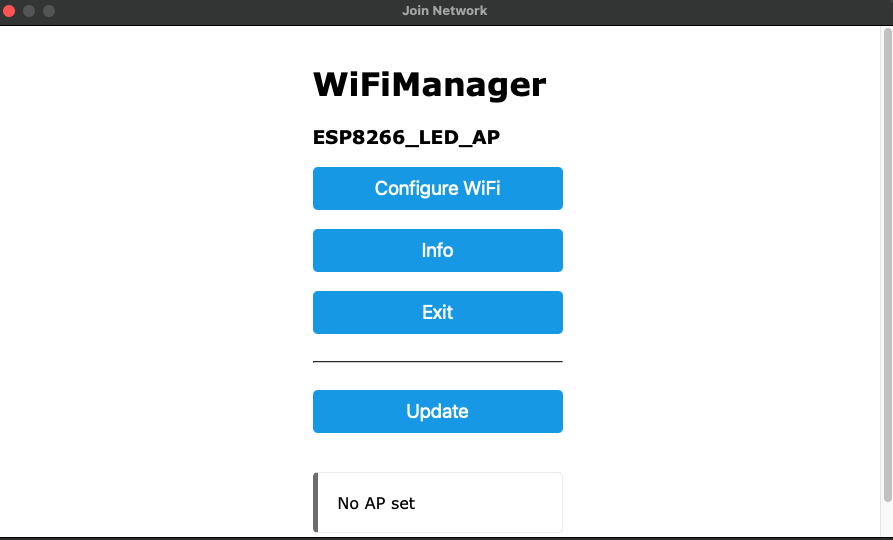
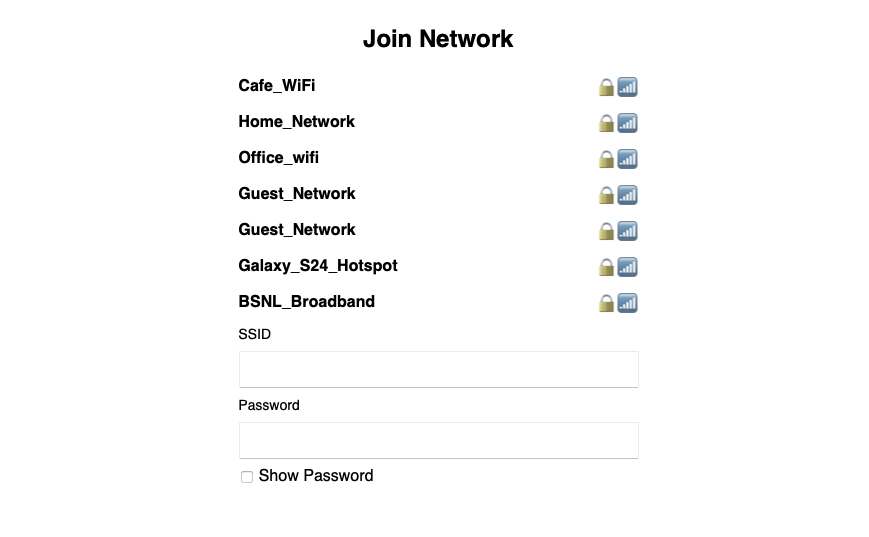
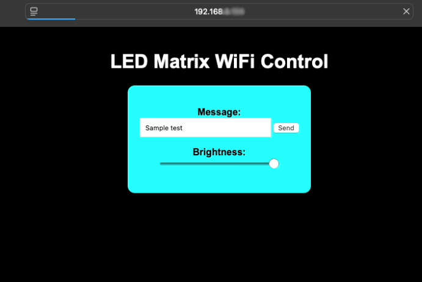

# ESP8266-LEDMatrix-WiFiDisplay
# ESP8266 LED Matrix WiFi Display

This project displays text on a MAX7219-based LED matrix using an ESP8266 module (e.g., NodeMCU). It allows users to control the displayed text and brightness level via a browser-based interface hosted by the ESP8266. A captive portal is automatically launched if no WiFi credentials are found.

## Sketch and Code
💡 The main sketch is in [LEDMatrix_WiFi.ino](LEDMatrix_WiFi.ino), but you can also view the syntax-highlighted C++ version here: [LEDMatrix_WiFi_Code.cpp](ESP8266_LED_Matrix_code.cpp)

## 🔧 Features

- ESP8266 auto-connects to saved WiFi or creates an access point if none is found.
- Web-based interface for:
  - Sending custom text to the LED matrix
  - Adjusting LED brightness
- Clean, styled HTML interface
- IP address displayed on the LED matrix after successful WiFi connection
- Optional WiFi reset for testing or clean startup

## 📱 How It Works

1. On boot, ESP8266 tries to connect to saved WiFi credentials.
2. If no WiFi is found (or reset is triggered), it creates a captive portal via WiFiManager.
3. User connects to the ESP8266 access point `ESP8266_LED_AP`.
4. The user selects and connects to a WiFi network.
5. After a successful connection, the ESP8266 reboots and displays its local IP on the LED matrix.
6. Enter that IP in your browser to open the control interface.

## 🖼️ Setup Screenshots

### 📲 Step 1: Connect to `ESP8266_LED_AP`

After uploading the code, power the ESP8266. It will create a WiFi hotspot named `ESP8266_LED_AP`.  
Connect to this network using your phone or laptop.



---

### 📶 Step 2: Select WiFi & Enter Password

Once connected, the **WiFiManager captive portal** will appear.  
Select your WiFi network from the list and enter its password.



---

### 🌐 Step 3: Access Web Interface to Control Display

After successful WiFi connection, the ESP8266 will reboot and display its IP address on the LED matrix.  
Enter this IP address into your browser to open the control panel.

Here you can:

- ✍️ Enter a scrolling message
- 💡 Adjust brightness using the slider



## 🌐 Web Interface Details

Once connected to your WiFi:

- 💬 **Send Text:** Type a message and click "Send" to display it as scrolling text.
- 💡 **Adjust Brightness:** Use the slider to control LED brightness (range: 0–15).
- 📟 The interface is mobile and desktop friendly.

## 🧰 Requirements

- **Board:** ESP8266 (NodeMCU, Wemos D1 Mini, etc.)
- **Display:** MAX7219-based 4-in-1 LED Matrix (FC16_HW)
- **Libraries:**
  - [`MD_MAX72xx`](https://github.com/MajicDesigns/MD_MAX72XX)
  - [`WiFiManager`](https://github.com/tzapu/WiFiManager)
- **IDE:** Arduino IDE

## 🚀 Getting Started

1. Install the required libraries via Arduino Library Manager or download from the links above.
2. Flash the `LEDMatrix_WiFi.ino` to your ESP8266 using Arduino IDE.
3. On first boot, WiFi credentials are cleared using:

   ```cpp
   wifiManager.resetSettings();  // Clears saved WiFi
